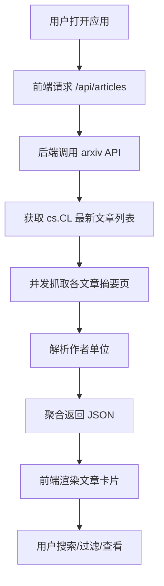

## 1. 产品概述

个人学术助手（arxiv NLP 每日速递）—— 每日自动抓取 arxiv 上 NLP（cs.CL，Computation and Language）领域的最新文章，并以卡片形式展示文章标题、作者、作者单位与摘要。
- 面向 NLP 研究者、学生与前沿技术爱好者，解决"每日手动翻阅 arxiv 追踪前沿论文"的痛点
- 提供一站式的当日论文浏览、检索与原文跳转体验

## 2. 核心功能

### 2.1 用户角色
本应用为单用户本地学术工具，无需区分角色。

### 2.2 功能模块
1. **首页**：Hero 控制台、搜索过滤栏、文章列表、文章卡片

### 2.3 页面详情

| 页面名称 | 模块名称 | 功能描述 |
|-----------|-------------|---------------------|
| 首页 | Hero 控制台 | 应用标题与副标题、当日日期显示、刷新抓取按钮、文章数量统计 |
| 首页 | 搜索过滤栏 | 关键词搜索（匹配标题/作者/摘要）、按类别标签过滤、排序（按时间/标题） |
| 首页 | 文章列表 | 以卡片网格展示文章，含加载骨架屏、空状态、错误重试 |
| 首页 | 文章卡片 | 展示标题、作者列表、作者单位、摘要（可展开/收起）、arxiv 原文/PDF 跳转链接、收藏标记 |
| 首页 | 详情抽屉 | 点击卡片打开侧边抽屉，展示完整摘要、全部作者与单位、分类标签、跳转链接 |

## 3. 核心流程

用户打开应用 → 前端请求后端 `/api/articles` → 后端调用 arxiv API 获取 cs.CL 最新文章列表（标题/作者/摘要）→ 后端并发抓取各文章摘要页解析作者单位 → 聚合后返回 JSON → 前端渲染文章卡片 → 用户搜索/过滤/展开查看/跳转原文。

## 4. 界面设计

### 4.1 设计风格
- **主题方向**："夜间图书馆 / 学术研究室"——深沉墨色背景配暖色羊皮纸卡片，营造静谧、专注的学术阅读氛围
- **主色调**：深墨蓝 `#0f1419` 背景，卡片为略浅墨色 `#1a1f2e`，文字为暖白 `#e8e4d9`
- **强调色**：学术琥珀金 `#d4a574`，用于标题高亮、按钮、链接与重点交互
- **辅助色**：暗酒红 `#7a3b3b` 用于收藏/标签
- **字体**：标题使用衬线体 Fraunces（学术期刊感），正文与 UI 使用 Manrope，摘要正文使用 Newsreader（长文阅读舒适）
- **按钮风格**：圆角矩形，主按钮为琥珀金底深色文字，次按钮为描边样式
- **布局**：桌面优先，卡片网格 + 侧边抽屉，顶部固定控制台
- **图标**：细线条线性图标，克制使用

### 4.2 页面设计概览

| 页面名称 | 模块名称 | UI 元素 |
|-----------|-------------|-------------|
| 首页 | Hero 控制台 | 墨色渐变背景、衬线大标题、日期徽章、琥珀金刷新按钮、文章计数 |
| 首页 | 搜索过滤栏 | 搜索输入框（描边）、类别标签胶囊、排序下拉 |
| 首页 | 文章列表 | 响应式卡片网格（桌面 2 列）、卡片悬停微动效、加载骨架屏 |
| 首页 | 文章卡片 | 衬线标题、作者胶囊、单位小字、摘要截断+展开、底部链接与收藏 |
| 首页 | 详情抽屉 | 右侧滑入抽屉、完整摘要、作者-单位对应列表、分类标签、跳转按钮 |

### 4.3 响应式
桌面优先设计（1280px+），平板自适应为单列卡片，移动端折叠控制台并优化触摸目标。

### 4.4 3D 场景
不适用。
