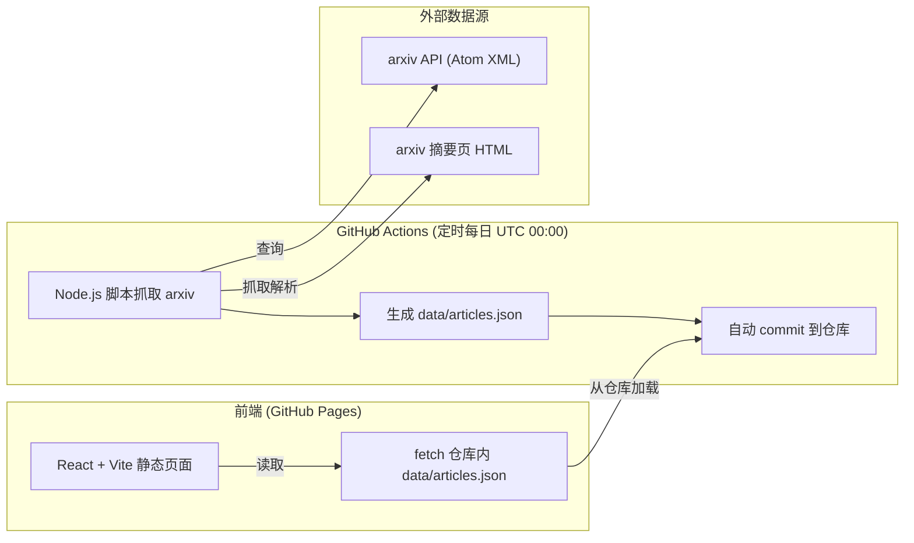

## 1. 架构设计



## 2. 技术说明

- **前端**：React@18 + tailwindcss@3 + vite
- **初始化工具**：vite-init（React + TypeScript 模板）
- **部署**：GitHub Pages（纯静态）
- **数据抓取**：GitHub Actions + Node.js 脚本
- **HTML 解析**：cheerio（解析 arxiv 摘要页提取作者单位）
- **HTTP 客户端**：axios
- **数据源**：
  - arxiv API：`http://export.arxiv.org/api/query?search_query=cat:cs.CL*&sortBy=submittedDate&sortOrder=descending&max_results=50`
  - arxiv 摘要页：`https://arxiv.org/abs/{id}`（解析作者单位）
- **数据存储**：`data/articles.json` 存入 Git 仓库
- **并发控制**：抓取摘要页时使用并发限制（≤5），遵守 arxiv 访问礼仪

## 3. 项目结构

```
academic-assistant/
├── .github/
│   └── workflows/
│       └── fetch-arxiv.yml      # GitHub Actions 定时任务
├── scripts/
│   └── fetch-arxiv.js           # 数据抓取脚本
├── data/
│   └── articles.json            # 生成的数据文件
├── src/
│   ├── components/              # React 组件
│   ├── types/                   # TypeScript 类型
│   └── App.tsx                  # 主应用
├── index.html
├── package.json
└── vite.config.ts
```

## 4. 路由定义

| 路由 | 用途 |
|-------|---------|
| / | 首页，展示当日 NLP 文章列表 |

## 5. 数据模型

### 5.1 数据模型定义

```typescript
interface Article {
  id: string;              // arxiv id，如 "2401.12345"
  title: string;           // 文章标题
  authors: Author[];       // 作者列表（含单位）
  abstract: string;        // 摘要
  categories: string[];    // 分类标签，如 ["cs.CL", "cs.AI"]
  published: string;       // 发布时间 ISO
  updated: string;         // 更新时间 ISO
  absUrl: string;          // 摘要页链接
  pdfUrl: string;          // PDF 链接
  comment?: string;        // arxiv 评论（如页数、会议）
}

interface Author {
  name: string;            // 作者姓名
  affiliation?: string;    // 作者单位（可能为空）
}

interface ArticlesData {
  articles: Article[];
  fetchedAt: string;       // 抓取时间
  count: number;
}
```

### 5.2 数据文件格式 (data/articles.json)

```json
{
  "articles": [...],
  "fetchedAt": "2025-01-15T00:00:00.000Z",
  "count": 50
}
```

## 6. GitHub Actions 工作流

### 触发条件
- **定时触发**：每天 UTC 00:00 (`0 0 * * *`)
- **手动触发**：workflow_dispatch

### 工作流步骤
1. checkout 代码
2. 设置 Node.js 环境
3. 安装依赖
4. 运行抓取脚本 `node scripts/fetch-arxiv.js`
5. 如果有变化，commit 并 push `data/articles.json`
6. 触发 GitHub Pages 重新部署
